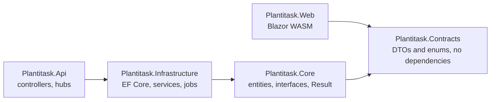

<p align="center">
  
</p>

<h1 align="center">Plantitask</h1>

<p align="center">
  <strong>Small Teams who Plant Trees</strong>
</p>

<p align="center">
  A nature-themed gamified task management platform where completing tasks grows virtual trees on your field, and a portion of revenue plants real ones.
</p>

<p align="center">
  <a href="https://www.codefactor.io/repository/github/ignjatradojicic/plantitask"></a>
  
  
  
  
  
  
  
  
  
  
</p>

---

## What is Plantitask?

Plantitask is a full-stack SaaS application that reimagines project management for small teams. Instead of spreadsheets and complex enterprise tools, teams organize work through a visual field where each project is a tree. As tasks get completed, the tree grows from a seed to a flowering tree.

The platform is built on a real mission: a portion of all future revenue will go to tree-planting foundations like One Tree Planted and Trees for the Future.

---
## Screenshots

### The Field
Each tree is a project group. You plant a seed to start one, drag trees around, and watch them grow as tasks get finished.
<p align="center">
  
</p>

### Kanban Board
Drag and drop between columns and within them. If two people move cards at the same time, the server retries against fresh data instead of letting one move overwrite the other.
<p align="center">
  
</p>

<details>
<summary><strong>More screenshots</strong></summary>

### Landing Page
<p align="center">
  
</p>

### My Garden
<p align="center">
  
</p>

### Task Creation
<p align="center">
  
</p>

### Notifications
<p align="center">
  
</p>

### Sign in
<p align="center">
  
  &nbsp;&nbsp;
  
</p>

</details>

## Stack

| | |
|---|---|
| Backend | ASP.NET Core 10 Web API, EF Core 10 with Npgsql |
| Frontend | Blazor WebAssembly, MudBlazor 9, PixiJS 8 through JS interop |
| Data | PostgreSQL 16 (with `pg_trgm` for search), Redis 7 for sessions and verification codes |
| Real time | SignalR, one hub for notifications and field growth and one for the kanban board |
| Jobs | Hangfire on Postgres storage |
| Payments | PayPal subscriptions and one time passes, with signed webhooks |
| Email | Resend over SMTP |
| Tests | xUnit against a real Postgres and a real Redis |
| Hosting | Docker Compose on my own server, deployed by GitHub Actions on a self hosted runner |

## How it's put together



Five projects and the dependencies only point one way. Core holds the entities and interfaces,
Infrastructure implements them with EF Core, the API is controllers and SignalR hubs, and Contracts
is the set of types the browser and the server share.

Services return `Result<T>` instead of throwing, controllers turn that into a response with one
extension method, and the frontend reads it back into a `ServiceResult<T>`, so every page handles
success and failure the same way.

## Decisions I'd like to talk about

### Making frontend and backend drift a compile error
The Blazor app used to keep its own copies of every DTO and enum. When I renumbered group roles to
match their permission ranks (25, 50, 75 and 100) the members page broke, because the frontend
still had 1 to 4 hardcoded. Nothing failed to build.

I moved every type the browser reads into `Plantitask.Contracts`, a project with no dependencies
that both the API and the web reference. I kept the old namespaces so no backend `using` had to
change, and moved it over in steps so nothing broke at once. A few things stayed on the server on
purpose, like the PayPal webhook shapes and settings that hold secrets. The SignalR kanban events
had been anonymous objects on the server and hand written classes in the browser, so they became
shared types as well. The JSON on the wire didn't change at all.
([484e302](https://github.com/IgnjatRadojicic/Plantitask/commit/484e302),
[6e2d4e3](https://github.com/IgnjatRadojicic/Plantitask/commit/6e2d4e3),
[1bc7d2c](https://github.com/IgnjatRadojicic/Plantitask/commit/1bc7d2c))

### I changed how deletion works the day after I shipped it
Deleting a task soft deleted the task, but its comments and attachments stayed live and could still
be fetched by id. My first fix made the query filters parent aware, so a comment was hidden if it
was deleted or if its task was. I liked that no write path could forget to cascade.

While I was writing down why that was safe I found two reasons it was a bad trade. Every read of a
comment or attachment now paid for a join to answer a question about something that rarely
happens. And the child rows were still marked as not deleted in the database, so any export or
cleanup job would have to walk the whole hierarchy again to find them. The next day I went back to
plain `IsDeleted` filters and made the delete itself flag every descendant.

That cascade was four separate `ExecuteUpdate` statements. Each one commits on its own, so a
failure halfway through left a half deleted group that other users could see. They run in one
transaction now.
([af8897b](https://github.com/IgnjatRadojicic/Plantitask/commit/af8897b),
[8ef5746](https://github.com/IgnjatRadojicic/Plantitask/commit/8ef5746),
[e963b5d](https://github.com/IgnjatRadojicic/Plantitask/commit/e963b5d))

### Two people dragging cards on the same board
Card order in a column is a `DisplayOrder` number, and moving one card renumbers the ones around
it, so two people dragging at once can both read the same numbers and write conflicting ones. I use
optimistic concurrency on Postgres's `xmin` system column. Every update checks that the row hasn't
changed since it was read, and a conflict throws instead of overwriting. The move then clears EF's
change tracker and tries again against fresh data, up to three times. Nothing is locked while
someone is dragging.

I didn't try to merge conflicting moves. Merging works for a document where two edits touch
different fields, but card order is closer to a bank transfer, where every number depends on the
others, so the only safe thing is to apply the move again on the current state. When I moved to
.NET 10 I didn't trust the SQL output to prove the token still worked, so I forced a real conflict
and checked that it threw. The renumbering itself causes most of the conflicts, so the next step is
sparse ranks that let one card move without touching the rest.
([`TaskService.MoveTaskAsync`](Plantitask/src/Plantitask.Infrastructure/Services/TaskService.cs))

### An audit log that doesn't depend on the request
The audit service writes through its own `DbContext` from a factory instead of sharing the
request's. That started in March as a fix for audit writes colliding with the request's own
operations on the same context. It turned out to be the right design anyway. An audit write
shouldn't depend on whatever the request's change tracker is holding, and it often runs after the
change it records has already been saved.

Audit rows can't be updated or deleted. They copy the user's name and email from the JWT at the
moment of the action, so the history doesn't change when someone renames themselves and writing a
row costs no extra query. The read endpoints stay closed until there's an admin panel, because
three tests document defaults that are too permissive to expose yet.
([6529f5d](https://github.com/IgnjatRadojicic/Plantitask/commit/6529f5d),
[e2464aa](https://github.com/IgnjatRadojicic/Plantitask/commit/e2464aa),
[ab106f7](https://github.com/IgnjatRadojicic/Plantitask/commit/ab106f7))

### Untangling authentication in the browser
The token handler and the auth service both depended on the authentication state provider only so
they could tell it something had changed. That meant the provider could never depend on anything
that refreshes, and an expired access token logged you out even when the refresh token had days
left. I moved the tokens and the refresh call into a `SessionService` and made the provider
subscribe to it. Once an expired token meant a quiet refresh instead of a logout, I could cut
access tokens from 60 minutes to 15.

Two details took the longest. The refresh goes through an HTTP client without the token handler,
because a refresh sent through the handler that triggered it waits on a lock its own caller already
holds, and in single threaded WebAssembly that's a deadlock rather than a delay. And two open tabs
share one refresh token through localStorage but each has its own lock, so both refreshed at the
same moment and the second one looked like a stolen token, which revokes every session. The lock
is `navigator.locks` now, which is shared across tabs the same way localStorage is, and the server
treats a token rotated in the last 5 seconds as a race instead of theft.
([3d185f2](https://github.com/IgnjatRadojicic/Plantitask/commit/3d185f2),
[b68a7eb](https://github.com/IgnjatRadojicic/Plantitask/commit/b68a7eb),
[92179dd](https://github.com/IgnjatRadojicic/Plantitask/commit/92179dd),
[406e2ef](https://github.com/IgnjatRadojicic/Plantitask/commit/406e2ef))

### My tests were passing against role ids that don't exist
The first test suite mocked `DbSet`. That can't see query filters, transactions or
`ExecuteUpdate`, which is exactly where multi tenant bugs live, and its test data used role ids 1
to 4 when the real ranks are 25, 50, 75 and 100. It was green anyway.

I deleted it and rebuilt the suite against a real Postgres that gets created and migrated once per
run. I also tried SQLite and measured it. It was only about 3 ms faster per test, and it can't use
Postgres's `xmin` concurrency token, so the kanban retry logic would never have been tested. The
suite has over 600 cases now. Every group scoped method gets two denial tests, one from a user
outside every group and one from the owner of a different group, because only the second catches a
check that forgot to scope itself.
([3b79b87](https://github.com/IgnjatRadojicic/Plantitask/commit/3b79b87),
[de7b4ee](https://github.com/IgnjatRadojicic/Plantitask/commit/de7b4ee))

## Deployment

```
push to main
  -> reset the deploy folder to the pushed commit
  -> docker compose build        (the old containers keep serving)
  -> start a throwaway Postgres and Redis on loopback
  -> dotnet test                 (a failure stops the deploy here)
  -> docker compose up -d
```

It runs on my own server behind a Cloudflare tunnel. I started on Azure App Service and moved to
Docker on a self hosted runner in May, which is what made the test gate possible. The API runs
migrations on startup.

## Running it locally

You need the [.NET 10 SDK](https://dotnet.microsoft.com/download/dotnet/10.0), PostgreSQL 16 and
Redis.

Create `Plantitask/src/Plantitask.Api/appsettings.Development.json` (it's gitignored):

```json
{
  "ConnectionStrings": {
    "DefaultConnection": "Host=localhost;Port=5432;Database=PlantitaskDb;Username=postgres;Password=yourpassword",
    "RedisConnection": "localhost:6379",
    "HangfireConnection": "Host=localhost;Port=5432;Database=PlantitaskDb;Username=postgres;Password=yourpassword"
  },
  "JwtSettings": {
    "Secret": "a-long-random-secret-at-least-32-characters",
    "Issuer": "PlantitaskApi",
    "Audience": "PlantitaskClient",
    "AccessTokenExpiryInMinutes": 15,
    "RefreshTokenExpiryInDays": 7
  },
  "App": { "FrontendUrl": "https://localhost:7110" }
}
```

And `Plantitask/src/Plantitask.Web/wwwroot/appsettings.json`:

```json
{
  "ApiSettings": { "BaseUrl": "https://localhost:5212" },
  "FileSettings": { "BaseUrl": "https://localhost:5212/files" }
}
```

Settings are validated when the API starts, so a missing key stops it with the key's name instead of
failing later.

```bash
dotnet run --project Plantitask/src/Plantitask.Api --launch-profile https
dotnet run --project Plantitask/src/Plantitask.Web --launch-profile https
```

The API is on https://localhost:5212 with Swagger at `/swagger`, and the app is on
https://localhost:7110.

**Tests** need their own Postgres and Redis, because the suite drops its database and flushes its
Redis index on every run. Never point them at your dev database.

```bash
export PLANTITASK_TEST_DB="Host=localhost;Port=5432;Username=postgres;Password=yourpassword"
export PLANTITASK_TEST_REDIS="localhost:6379"
dotnet test Plantitask/tests/Plantitask.Tests/Plantitask.Tests.csproj
```

`PLANTITASK_TEST_DB` has no `Database=` part on purpose. The fixture creates its own.

**Full stack with Docker:** put a `.env` next to `docker-compose.yml` with `POSTGRES_PASSWORD`,
`JWT_SECRET` and `RESEND_API_KEY`, then run `docker compose up -d --build`.

## What's next

- An admin panel, which is also what the audit log routes are waiting on
- A real night scene for the field in dark mode
- Load testing with k6
- AI features on top of the task data, running on a self hosted model

## About me

I'm Ignjat Radojicic.
[GitHub](https://github.com/IgnjatRadojicic)

## License

Proprietary. All rights reserved.
