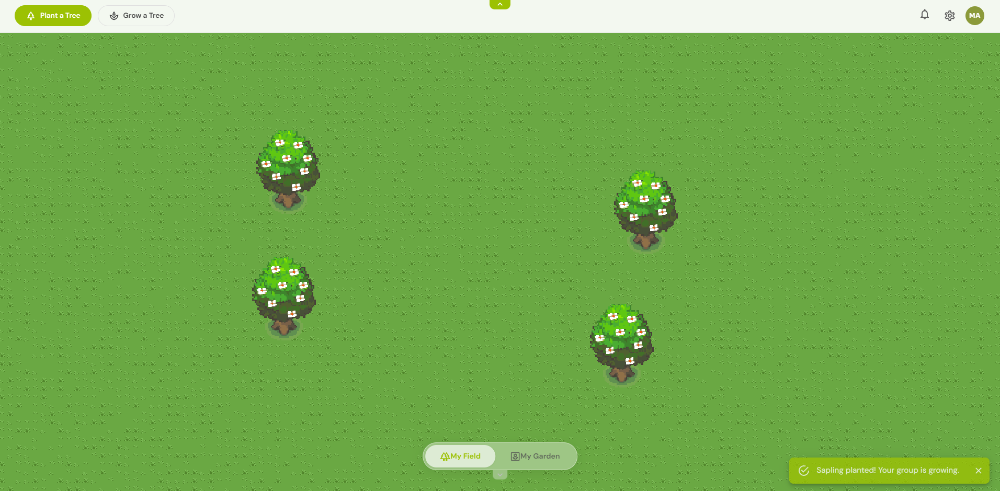
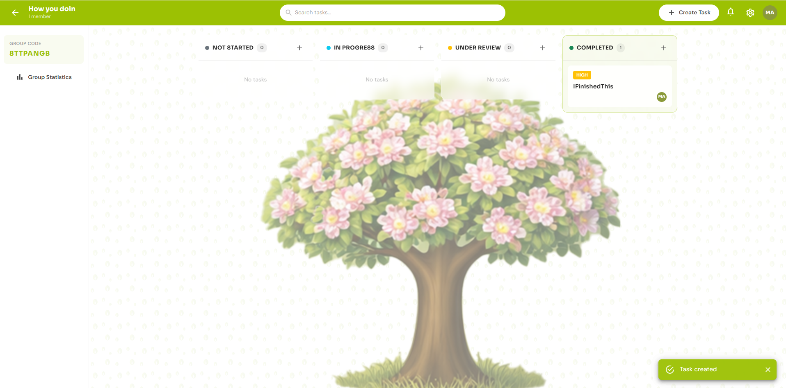
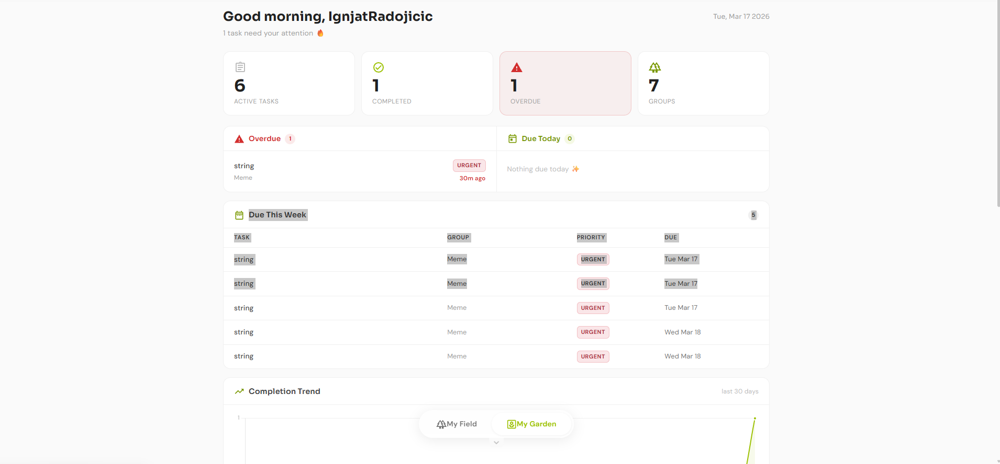
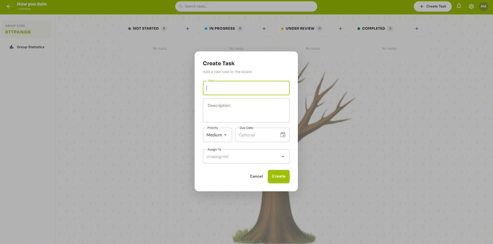
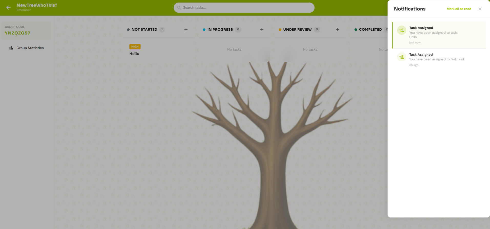
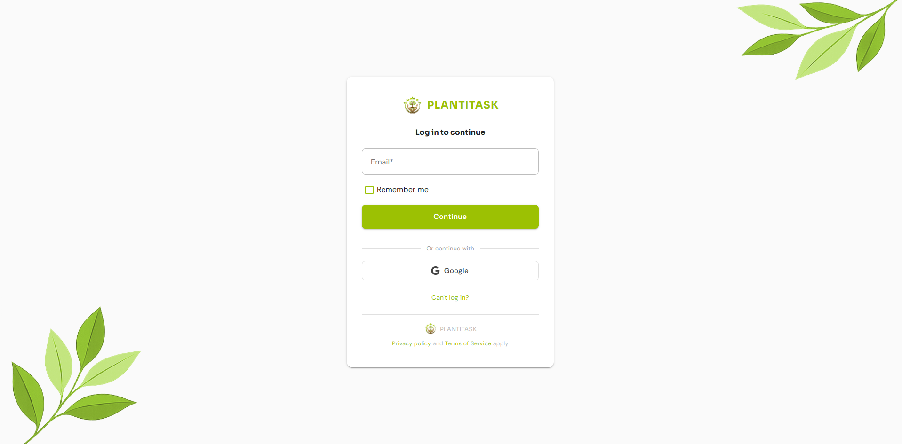
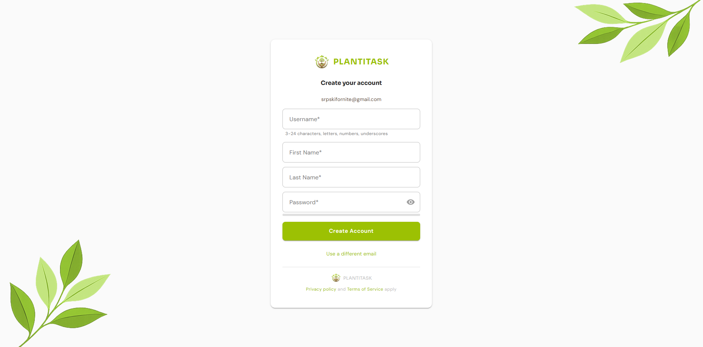

<p align="center">
  
</p>

<h1 align="center">Plantitask</h1>

<p align="center">
  <strong>Small Teams who Plant Trees</strong>
</p>

<p align="center">
  A nature-themed gamified task management platform where completing tasks grows virtual trees on your field, and a portion of revenue plants real ones.
</p>

<p align="center">
  <a href="https://www.codefactor.io/repository/github/ignjatradojicic/plantitask"></a>
  
  
  
  
  
  
  
  
  
  
</p>

---

## What is Plantitask?

Plantitask is a full-stack SaaS application that reimagines project management for small teams. Instead of spreadsheets and complex enterprise tools, teams organize work through a visual field where each project is a tree. As tasks get completed, the tree grows from a seed to a flowering tree.

The platform is built on a real mission: a portion of all future revenue will go to tree-planting foundations like One Tree Planted and Trees for the Future.

---

## Screenshots

### Landing Page
<p align="center">
  
</p>

### The Field
> Each tree represents a project group. Plant seeds to create groups, drag trees to rearrange, and watch them grow as tasks are completed.
<p align="center">
  
</p>

### Kanban Board
> Drag-and-drop task management with optimistic concurrency. Move tasks between columns or reorder within a column. The backend handles simultaneous edits gracefully with automatic retry logic.
<p align="center">
  
</p>

### My Garden (Dashboard)
> Personal overview with active tasks, overdue alerts, completion trends, and group statistics.
<p align="center">
  
</p>

<details>
<summary><strong>More Screenshots</strong></summary>

### Task Creation
<p align="center">
  
</p>

### Real-time Notifications
<p align="center">
  
</p>

### Authentication
<p align="center">
  
  &nbsp;&nbsp;
  
</p>

</details>

---

## Tech Stack

### Backend

| Layer | Technology |
|-------|-----------|
| Framework | ASP.NET Core 10 Web API |
| Architecture | Clean Architecture (Contracts / Core / Infrastructure / API) |
| ORM | Entity Framework Core 10 (Npgsql) |
| Database | PostgreSQL 16, with `pg_trgm` for search |
| Authentication | JWT access tokens (15 min) + rotating refresh tokens with reuse detection |
| Session Store | Redis (refresh tokens, verification codes, email verification flags) |
| Real-time | SignalR (notification, field and kanban hubs) |
| Background Jobs | Hangfire on PostgreSQL storage |
| Email | Pluggable provider: Resend over SMTP in production, SendGrid client retained |
| Payments | PayPal orders and subscriptions with signed webhooks |
| Entitlements | Versioned plan catalogue plus dated grants, resolved per request |
| Concurrency | Optimistic concurrency (`xmin`) with a bounded retry loop on Kanban moves |
| Soft Delete | Flat `IsDeleted` filters plus an explicit transactional write cascade |
| Audit Trail | Separate `DbContextFactory` connection so audit rows survive a rollback |
| Testing | xUnit against a real PostgreSQL and a real Redis |
| API Documentation | Swagger / OpenAPI |
| Rate Limiting | Fixed window: 60/min general, 15/min auth, 10 per 5 min verification |

### Frontend

| Layer | Technology |
|-------|-----------|
| Framework | Blazor WebAssembly (.NET 10) |
| Component Library | MudBlazor v9 |
| Canvas Engine | PixiJS 8 (via JS interop) |
| Shared Types | `Plantitask.Contracts` referenced directly, no hand-copied models |
| Session | `SessionService` plus a cross-tab `navigator.locks` mutex |
| Local Storage | Blazored.LocalStorage |
| Styling | Custom CSS with a dark mode toggle (Sora + DM Sans typography) |

---

## Architecture

Five projects. The dependency arrows only point one way.

```
src/
├── Plantitask.Contracts/        # Wire shapes both sides reference. Zero dependencies.
│   ├── Enums/                   # GroupRole, PlanTier, GrantSource, NotificationType, TreeStage
│   ├── Groups|Tasks|Plans|...   # Every DTO the browser deserializes
│   └── Kanban/                  # Typed SignalR event payloads
│
├── Plantitask.Core/             # Entities, interfaces, Result/Error, projections
│   ├── Common/                  # BaseEntity family, Result, Error, pagination extension
│   ├── Entities/                # User, Group, TaskItem, PlanVersion, UserPlanGrant
│   ├── Interfaces/              # IGroupService, ITaskService, IEntitlementService, ...
│   ├── Plans/                   # UserEntitlements, the resolved "what may this user do"
│   ├── Projections/             # Expression trees EF translates to SQL
│   └── Specifications/          # Reusable predicates that stayed off the entities
│
├── Plantitask.Infrastructure/   # EF Core, migrations, service implementations
│   ├── Data/                    # DbContext, configurations, converters, 20 migrations
│   └── Services/                # Auth, Group, Task, Entitlement, PayPal, jobs, storage, email
│
├── Plantitask.Api/              # Controllers, middleware, hubs, Program.cs
│
└── Plantitask.Web/              # Blazor WebAssembly frontend
    ├── Pages/                   # Landing, Field, Kanban, Dashboard, Pricing, Settings
    ├── Services/                # API clients on BaseApiService, SessionService, SignalR clients
    └── wwwroot/                 # PixiJS field engine, session-lock.js, CSS

tests/
└── Plantitask.Tests/            # xUnit suite against a real Postgres and a real Redis
```

**Result pattern, not exceptions.** Services return `Result<T>`. Controllers convert with `ToActionResult()`. The frontend mirrors it with `ServiceResult<T>`, so every page handles success and failure in the same two lines.

**One place per rule.** `IEntitlementService` is the only code that decides what a user may do. `IGroupService` is the only code that answers a membership question. Enforcement and display read the same number, which removes the class of bug where the API refuses something the UI says is allowed.

---

## Design Patterns and Principles

**Clean Architecture** with strict dependency inversion. Core has zero external dependencies and defines all interfaces, Infrastructure implements them, the API layer only orchestrates, and `Plantitask.Contracts` sits below everything as a dependency-free leaf both the API and the browser can reference. No project reference flows inward.

**Result Pattern** replaces exception-based error handling across the entire backend. Services return `Result<T>` instead of throwing. Controllers convert results via a `ToActionResult()` extension. The frontend mirrors this with `ServiceResult<T>`, so every page follows the same two-line shape: check success, then use the data or show the error.

**Dependency Inversion (SOLID "D")** applied throughout. Every service has an interface, and pages and controllers depend on abstractions rather than concrete classes. This is what made the test rebuild possible: `BackgroundJobService` could only be tested once it took `IBackgroundJobClient` and `IRecurringJobManager` instead of calling Hangfire's static facades, because a static call has nothing to substitute.

**BaseApiService Inheritance** (Open/Closed). Every frontend HTTP service inherits a shared abstract base providing `GetAsync<T>`, `PostAsync<T>`, `PutAsync<T>`, `PatchAsync<T>`, `DeleteAsync<T>` and unified error parsing. Adding a new API service means writing only its public methods.

**DelegatingHandler Pipeline** for cross-cutting authentication. `AuthTokenHandler` attaches the access token to outgoing requests, handles a 401 with a silent refresh, and replays the failed request. Individual services never touch authorization headers. The refresh itself deliberately goes through a *separate* named client with no handler, because a refresh flowing through the handler that triggers it would recurse into a lock the outer frame already holds.

**Refresh Token Rotation** with reuse detection. Each refresh invalidates the previous token and issues a new pair, and the `ReplacedByToken` chain is what makes a replay detectable. Tokens are stored as SHA-256 rather than BCrypt, because a salted hash can be verified but never looked up by, and a 512-bit random token gains nothing from a deliberately slow hash.

**Optimistic Concurrency Control.** Entities carry a concurrency token checked by EF Core on every update, so two users editing the same task means the second write gets a `DbUpdateConcurrencyException` rather than silently clobbering the first. No database locks are held during user think-time.

**Retry-Based Conflict Resolution** for Kanban moves. Rather than merging conflicting changes, which is complex and error-prone for sequential data, the service clears the change tracker and retries against fresh state: up to 3 attempts with 50ms, 100ms and 150ms backoff. Sequential `DisplayOrder` values behave like a bank transfer rather than a document edit, so they cannot be safely merged. This mirrors what Jira, Trello and GitHub Projects do.

**Observer Pattern (Event Bus)** on the frontend. `FieldUIService` exposes `OnPlantTreeRequested` and `OnJoinTreeRequested`, so the layout's navigation buttons fire events and the Field page subscribes. No tight coupling, no query parameter hacks, no shared mutable state.

**Background Job Processing** via Hangfire on PostgreSQL storage. Recurring jobs handle the overdue digest, attachment purging and notification cleanup, and every recurring job is registered with `AddOrUpdate` keyed by a fixed id so a restart updates rather than duplicates.

**Soft Delete Pattern** across all major entities, with a flat `!IsDeleted` filter applied in `OnModelCreating` and an explicit transactional write cascade that flags every descendant. Deleted rows keep the audit trail intact. A user-facing account recovery window is planned but not implemented.

**Audit Logging** on state-changing operations, through `IAuditService`. It writes on its own connection via `IDbContextFactory`, deliberately, so an audit row survives the caller rolling back. An audit trail that vanished with the transaction it was recording would be worthless.

**Custom Authentication State Provider** bridges JWT tokens with Blazor's authorization framework. It parses claims without signature validation, since that is the backend's job, and exposes the identity to `AuthorizeView` and `[Authorize]`. It *subscribes* to `SessionService.OnTokensChanged` rather than being pushed into, which is what broke the dependency cycle that previously prevented it from refreshing at all.

**Factory Pattern** for design-time context creation. `ApplicationDbContextFactory` serves EF Core migrations, entirely separate from the runtime DI pipeline.

**Seeded Random Generation** for deterministic PixiJS field layouts. Decorations are placed by a seeded Lehmer generator, so the field looks identical across sessions and devices without storing a single position.

---

## Timeline

Where the work went. The rewrite window this README documents starts at the marked row.

| Dates | Work |
|-------|------|
| Mar 22 to Mar 24 | PayPal vertical slice: core interfaces, service, controller, frontend flow, pricing and callback pages, subscription management in settings |
| May 6 | Azure App Service deployment replaced with Docker on a self-hosted runner, auto-migration on boot, static file serving for uploads |
| May 8 to May 10 | Entity taxonomy: `IEntity`, `IUpdatable`, the three base classes, self-managed entities, lookups normalized, audit log parameters simplified |
| May 15 to May 23 | Projection pass over `AttachmentService` and `GroupService`, membership helpers extracted, client-side evaluation removed, manual timestamp assignments deleted |
| Jul 6 to Jul 14 | Deploy workflow and Linux server config, audit logging from JWT claims, entity refactor migration, UTC stamping, patch semantics, persisted Hangfire job ids |
| **Jul 15 onward** | **The window below. 220 commits.** |
| Jul 19 to Jul 20 | Task query rewrite, `PaginatedList` clamping, trigram search, lookup caching, parent-aware query filters |
| Jul 21 to Jul 23 | Deletion cascade in a transaction, filter strategy reversed, RBAC holes closed, ownership transfer, role renumbering, `Plantitask.Contracts` extracted |
| Jul 24 to Jul 25 | Refresh tokens moved to SHA-256, reuse detection, email hardening, JWT settings bound and validated |
| Jul 26 to Jul 29 | Upload validation centralized, path containment, streaming downloads, join code entropy, BCrypt work factor pinned |
| Jul 30 to Aug 1 | `SessionService` extracted, auth dependency cycle broken, cross-tab refresh lock, access token dropped to 15 minutes |
| Aug 2 to Aug 5 | Audit action fix, reset tokens hashed, notification digests and actor attribution, projection pass over dashboard and comments |
| Aug 8 | PayPal webhook hardening, OAuth token caching, XML summaries across the service layer, .NET 10 migration |
| Aug 10 to Aug 15 | Test suite rebuilt on a real Postgres, CI test gate, Docker build context fixes, Blazor cache header fix |
| Aug 17 | Plan catalogue and entitlements, storage quota, attachment purge job |

---

## Engineering Decisions

Organized by layer, not by date. Each one is a call that was made deliberately, with the reason it was made.

### 1. The Data Model

#### Three base classes, chosen by who owns the row

`IEntity` carries `Id` and `CreatedAt`. `IUpdatable` carries `UpdatedAt`. Entities pick a base class by how their lifecycle actually works:

- **`BaseEntity`** is the full set: timestamps, soft delete, and `CreatedBy` / `UpdatedBy`. For rows a person acts on and another person may act on later.
- **`SelfManagedEntity`** drops `CreatedBy` and `UpdatedBy`. A notification, a notification preference and a task comment all belong to exactly one user by construction, so an actor column would either duplicate the owner or sit ambiguous. Dropping it is what later left room for `ActorId` to mean something specific rather than being squeezed into `CreatedBy`.
- **`ImmutableEntity`** is `Id` and `CreatedAt` only. An audit log is never updated and never deleted, so giving it the columns to do either would be a lie in the schema.

`TaskComment` keeps `CreatedBy` as the author and names the navigation `Author`, because "who created this row" and "who wrote this comment" are the same fact here and two columns holding one fact will drift.

#### Timestamps are stamped once, in `SaveChangesAsync`

The override sets `CreatedAt` on add and `UpdatedAt` on modify. Every manual `entity.CreatedAt = DateTime.UtcNow` in the service layer was deleted, because a rule enforced in forty call sites is forty chances to forget.

There is exactly one escape hatch and it is documented at every use: `ExecuteUpdateAsync` never goes through the change tracker, so the override never runs. Every `SetProperty` chain sets `UpdatedAt` by hand, and that is the reason.

#### Time is UTC at the conversion layer, not at the call site

Tasks arriving from the frontend carried `DateTimeKind.Unspecified`, which Npgsql refuses to write to a `timestamptz`. Fixing that per call site means every future endpoint gets to forget.

`UtcDateTimeConverter` is registered through `ConfigureConventions` for every `DateTime` property in the model. Writes stamp `Utc` if it is not already, reads stamp `Utc` defensively even though Npgsql already returns it. The invariant holds for properties that do not exist yet.

#### Business rules live where they can be translated

`User.HasActivePremium` started as a computed property to avoid an anemic domain model. It is a compiled `Func`, so EF cannot translate it, which means every query needing that rule had to hand-write it and the copies drifted. `UserSpecifications` holds the reusable predicates, and where a projection must inline the rule anyway, the specification sits next to it saying so. The lesson is not "keep entities anemic", it is that a rule the database also needs to evaluate has to be expressible as an expression tree.

### 2. Deletion

#### The strategy that was tried, then replaced

Soft deleting a task used to leave its comments and attachments live and reachable by direct child id. The first fix, on July 20, was **read-time derivation**: parent-aware query filters, so `TaskComment` and `TaskAttachment` filtered on `!IsDeleted && !Task.IsDeleted`. The appeal was that a child's own flag kept a single meaning and no write path could forget to cascade.

It was replaced the next day. Two reasons, both discovered by writing out why it was safe:

- Every read of a child paid a join to answer a question about a delete that happens rarely.
- Child rows stayed physically marked `IsDeleted = false`, so any retention or export job would have to reimplement the hierarchy walk to find them.

The write cascade already flags every descendant, so a flat `!e.IsDeleted` filter applied in `OnModelCreating` is sufficient and cheaper. Deletion state is now sourced from rows, not from parent navigations.

#### Cascades are transactions

`ExecuteUpdateAsync` executes immediately instead of deferring to `SaveChangesAsync`, so group and task deletion were running as four independent autocommit transactions. A failure between them left the data permanently inconsistent, and a concurrent reader could observe a half deleted group.

`IApplicationDbContext` exposes `BeginTransactionAsync` and nothing else from the database facade, deliberately, so raw SQL stays off the interface.

#### Soft deleted attachments now free their bytes

Deleting a tree or a task soft deleted every attachment row in one statement and never touched storage. That was a slow leak until the storage quota started counting live rows, at which point it became a way around the cap entirely: upload to the limit, delete the tree, upload again. The quota freed, the disk did not.

`FilePurgedAt` separates "row deleted" from "bytes gone". That is what makes the purge job safe to run twice, and lets a file that could not be deleted come back around on the next pass instead of being lost. A failed file logs and moves on rather than throwing, so one unreachable blob does not cost the rest of the batch.

`IX_TaskAttachments_PendingPurge` is a partial index acting as a worklist, so the check reads an empty index in the steady state instead of scanning every attachment ever uploaded to prove there is nothing to do.

The job runs every fifteen minutes, and that number is not arbitrary. It is the window in which the quota and the disk disagree, because deleting a tree frees quota at once and the bytes go when the job runs.

### 3. Reads

#### `Include` is for tracking, `Select` is for reading

The principle that drove a pass over every service: navigation access inside a `Select` is translated to a join already, so `Include` alongside a projection is pure overfetch. `Include` earns its place only when the entity is being tracked and mutated.

Where a method both reads and mutates, the projection carries the entity next to the scalar, because EF still tracks entities returned inside a projection. Two things change when you do that, and both bit at least once:

- The null check has to test the projected row, not the entity inside it, or the dereference happens before the guard.
- The navigation is no longer populated, so every read through it has to move onto the projected columns or it throws on the success path.

The offenders this found:

- The personal dashboard loaded every task ever assigned to a user, with three joined entities and no `AsNoTracking`, then filtered five ways in memory. Two years in that is hundreds of tracked entities materialized to render six rows, and it gets slower every month the account exists.
- Group statistics loaded whole tasks to count them, and its trend was silently always zero, because the points were built from a timestamp while the dictionary was keyed on midnight. The chart had never once rendered real data.
- Mark all as read loaded every unread row to flip two booleans. A user returning to 300 unread paid 300 materialized entities and 300 updates for work that is one statement.
- `AttachmentService` called `GetFileUrl` inside a LINQ expression, forcing client-side evaluation. SQL projection and in-memory mapping are separate steps now.

#### Search is a trigram index, which forced the query shape

Substring search on task titles was `LOWER()` plus `Contains`, which no index can serve. The fix is a `pg_trgm` GIN index with `gin_trgm_ops`, but that index only accelerates `ILIKE`, so the query had to move to `EF.Functions.ILike` first. The index and the query shape are one decision, not two.

#### Pagination clamps before it pages

`PaginatedList` gained a factory so page number and size are clamped before `Skip` and `Take` rather than after. The count runs before the projection where it can, because `CountAsync` over a projected query becomes `SELECT COUNT(*) FROM (subquery)`, which is marginally heavier. It is documented as the thing to hand-roll if a specific endpoint ever gets hot enough to care.

The type was later split: the wire shape lives in `Plantitask.Contracts`, and `ToPaginatedListAsync` lives in Core, because the response shape should not drag Entity Framework into a project the browser references.

#### Lookups are cached in memory

Task statuses are read on nearly every task operation and change roughly never. They sit in `IMemoryCache` rather than being fetched per request.

### 4. Authorization

#### `GroupService` owns the membership question

Audit, attachment, comment, task and dashboard services all used to hand-roll their own membership queries. They now ask `IGroupService`, so the tenancy rule has one implementation and one place to fix.

The risk was noted when the decision was made: this points at `GroupService` becoming a god class, and bridging authorization out to its own service is the planned exit if it keeps growing. Writing the risk down at the time is what makes it a decision rather than a drift.

#### The rank is one number

It lived in three places at once: the `GroupRole` enum, a `GroupRoleLookup.PermissionLevel` column, and a `PermissionLevels` constants class. Every guard converted between them, and the frontend kept a fourth copy as hardcoded integers.

Now the enum value **is** the rank and **is** the lookup primary key. Owner 100, Manager 75, TeamLead 50, Member 25, with the gaps at 10, 40 and 60 left free on purpose so adding a Viewer later is a data change and not a renumber of everything below it. `RoleLevel`, `RoleFromLevel` and the constants class are all gone, and role validity is `Enum.IsDefined` with the FK catching anything with no seed row.

`GroupMembers.RoleId` is a `Restrict` FK, so the migration inserts the new rows, remaps every membership, then deletes the old ones. The mapping was verified against the dev database before it shipped.

The rename came with it. A method returning a `GroupRole` while being called `GetUserPermissionLevelAsync` and stored in `permissionLevel` was a lie about what the value is.

#### The holes that were open

- `ChangeUserRoleAsync` and `RemoveUserFromGroupAsync` had RBAC gaps, including a missing null check on the target's role level.
- Rejoining a private group skipped the password check entirely.
- `MoveTaskAsync` compared permissions where it needed a membership check.
- A cross-column Kanban drag did not answer to the same rule as the status endpoint, so the drag was a way around a check the button enforced.
- `UpdateCommentAsync` proved authorship but not current membership, so someone removed from a group could still edit their old comments.
- Logout deleted any refresh token presented to it, so any authenticated user holding someone else's token could end that session.
- Attachment deletion did not make the uploader prove membership.
- The unique index on `(GroupId, UserId)` had been dropped by accident during a query filter cleanup. `JoinGroupAsync` guards duplicate membership in code, but code guards race and the index is the real guarantee.

#### Responses are derived from state, not from assumptions

A handler that reconstructs its response from what it believes it just did will report the wrong thing the moment a guard is loosened. Responses read back the state that was actually written.

### 5. Task Semantics

Small rules, each one a real bug:

- **Set-once fields stay set once.** `CompletedAt` and similar fields have explicit set-once semantics rather than being reassigned on every touch.
- **Patch distinguishes absent from empty.** `UpdateTaskDto.Description` treats `null` as "not supplied" and empty string as "clear it", which are different intentions that were collapsing into one.
- **A due date can be cleared.** It could be set and changed but never removed.
- **New tasks land in the right place in a column.** Display order is queried rather than assumed, and the `MaxAsync` idiom was extracted so status changes and creation cannot compute it differently.
- **`ChangeTaskStatusAsync` never assigned the new status.** It captured the old one, updated `CompletedAt` and `DisplayOrder`, and left the task in its old column with an order computed for the target column. The next-order calculation also sat below a `SaveChangesAsync` that had already mutated the tracked entity.
- **Deleting one task soft deleted the whole group feed.** Notification matching used a subquery over every task in the group instead of matching `RelatedEntityId` directly.

### 6. Background Jobs

#### Job ids are persisted, because the handoff is not fire and forget

Hangfire itself is fire and forget, but the handoff from scheduling to storing the returned id is not. Without persisting it, a scheduled reminder could not be found later, so cancellation was dead code and rescheduling silently stacked duplicates.

`DueSoonJobId` is written before `SaveChangesAsync`, not after, which is the bug that made the id never reach the database in the first place. `null` is the single contract for "no notification scheduled".

The new reminder is scheduled **before** the old one is cancelled, so a failure between the two leaves a reminder rather than none.

#### Reminders guard against the past

Without a guard, Hangfire fires a past-dated reminder immediately, so a task due this afternoon would email its assignee the moment it was assigned.

#### Recurring jobs are registered by id

`AddOrUpdate` is keyed by id, so a typo adds a second registration instead of updating the first, and the sweep then runs twice a day. The three ids are fixed strings and there is a test pinning them.

#### One digest, not one email per task

The overdue check sent one notification and one email per overdue task. It now sends a single digest per user, which expands in the UI into the live list of overdue tasks and clears itself when they are all done rather than contradicting the list it sits above.

Dedupe reads a dedicated `NotificationDigestLogs` table rather than inferring from notification rows, because a user with in-app notifications turned off has no row to infer from and was being mailed twice. Notifications and markers commit together and emails go afterwards, so losing an email is the intended trade against notifying somebody twice.

#### Notifications know who caused them

The actor only existed as interpolated text inside `Message`, so a rename left every past notification showing the old name and the UI had no way to reach an avatar or a profile link. Parsing it back out of a string is not an option, so the column had to exist before the rows did.

`ActorId` is nullable because the due soon and overdue jobs have no actor, and it cannot reuse `UserId` because `UserId` is the recipient and is also the authorization key on `MarkAsRead`. One comment writes a row per recipient and they all share one actor, so the two facts cannot live in one column. `ActorName` is resolved through the navigation and never stored, so a rename shows up on every past notification.

Fan outs used to `Add` plus `SaveChangesAsync` per recipient, so a 20 member group cost 20 sequential round trips inside the request. They collect, `AddRange` and save once now. Status changes notify the assignee and the creator instead of all 19 other members on every drag to Done.

Creating a task with an assignee never notified anyone, because two near-identical notifier methods took their parameters in different orders and the controller passed the assignee into the actor slot, making the self-exclusion check always true.

### 7. Authentication and Sessions

#### The auth graph stopped being a circle

`AuthTokenHandler` and `AuthService` both depended on `CustomAuthStateProvider` only to push a notification into it, which meant the provider could never depend on anything that refreshes. `SessionService` now owns the token pair and the refresh call, and the provider subscribes to `OnTokensChanged` instead of being pushed into.

Falling out of that shape:

- An expired access token used to mean "delete both keys and go anonymous", so idling past 60 minutes logged you out while the refresh token still had days left. It now spends the refresh token first, which is the prerequisite for dropping the access token from 60 minutes to 15.
- The refresh call goes through a bare named client with no handler in its pipeline. A refresh sent through the handler that owns it would recurse into a `SemaphoreSlim` the outer frame already holds, and WASM is single threaded, so that is a hard deadlock rather than a wasted retry.
- `SessionService` is registered Scoped. Transient would give each consumer its own lock and its own event, so a refresh would write storage and never reach the UI. Singleton is identical to Scoped in WASM but would share one user's tokens with every user under Blazor Server.
- The three SignalR clients depend on `ISessionService` rather than `IAuthService`, because they only ever needed a token and dragging in login and register to fetch one is the wrong dependency.

#### Two tabs used to log you out of everything

Tabs share one localStorage and therefore one single-use refresh token. Both notice the expiry at the same moment, both hand in the same token, the server rotates the first and sees the second arrive carrying a token it just marked used. That is the signature of theft, so reuse detection fired and revoked every session on every device.

The `SemaphoreSlim` could never catch it: Scoped in WASM means one instance per tab, so the two locks had never heard of each other. A lock only protects state inside its own scope, and localStorage sits above both of them.

`session-lock.js` wraps `navigator.locks`, whose scope is exactly one browser profile, which is exactly the scope that shares localStorage. The token-changed recheck at the top of the critical section already existed and was always correct, it just never had a chance to be true because the tabs were never serialized. It degrades rather than fails if the script or the API is missing.

#### Refresh tokens are SHA-256, and rotation marks instead of deletes

BCrypt embeds a random salt, so hashing the same token twice gives different outputs. You can verify against it but you can never look it up by it. A lookup key needs a deterministic hash, and SHA-256 is right here because a 512-bit random token cannot be brute forced, so the deliberate slowness of BCrypt buys nothing.

Rotation marks the old token revoked and leaves it readable. That is the only reason a replayed token can be told apart from an unknown one. Logout deletes outright, because nothing is being detected there. There is a test pinning that pair, because if rotation ever tidied up by deleting, reuse detection would go quiet with nothing failing.

A just-rotated token arriving in the grace window is treated as a race, not as theft. Password reset spends every live token rather than only the one presented.

#### Enumeration and timing are part of the contract

- An unknown email burns the same BCrypt work as a wrong password, so timing cannot say which case it was.
- Unknown email, wrong password and unconfirmed account return the identical message, not merely all fail.
- Forgot password writes nothing and sends nothing for an address with no account, and still reports success.
- Logout returns success on a token that is not yours, so the endpoint cannot be used to probe which refresh tokens exist.
- Refresh failures are all 401 with one message. Different messages per branch told a caller which tokens existed and in what state.
- A username collision returns a conflict instead of a 500, and comparison is case sensitive on purpose while email is normalized to lowercase on every path.

#### The details underneath

- The BCrypt work factor is pinned and passed to `HashPassword`, which it was not, so the pin had no effect. Login rehashes when the stored factor is below the current one.
- Access tokens dropped from 60 minutes to 15. That number is the window a compromised session survives everything you can do about it, since logout, password reset and revoke-all all kill the refresh token while a signed JWT stays valid until `exp`.
- `MapInboundClaims` is off and `sub` is read as `sub`. The remapping meant `NotificationHub` was silently finding nothing and only working because of a duplicate `userId` claim, so deleting that duplicate broke the hub with both lookups returning null.
- JWT settings are bound once and validated on start. The bearer handler and the token generator used to read the same section separately, one through validated options and one through raw configuration with null-forgiving operators.
- Password reset and password change revoke every session.
- Register password rules apply to change password too, and the validation message no longer says 3 when the minimum is 8.
- Google sign-in requires a verified Google email and handles username collisions.
- `RememberMe` was removed. There was no meaningful distinction between a browser session and an indefinite one here, so the option was a switch that implied a guarantee it did not provide.

#### Join codes are derived, not random

The generator's only varying input was `DateTime.Ticks`. On most machines `UtcNow` does not advance in 100ns steps, it advances in system timer steps somewhere between 1ms and 15.6ms, so the real keyspace was not the nominal 1.1 trillion but the number of distinct tick values that could fall inside the creation window. Group codes are join credentials, so that gap matters.

### 8. Uploads and Files

- **Client text never reaches a path, and the invariant is verified anyway.** Containment is checked in every public method that touches disk, not only in download, because the three can regress independently.
- **Three escapes beyond the obvious dot segments are covered.** An absolute key makes `Path.Combine` discard the base entirely, and a sibling directory whose name shares a string prefix with the root is only caught because the check appends a separator.
- **Magic bytes are checked against the extension.** A Windows executable named `photo.png` and a real PNG named `report.pdf` are both rejected, because an extension allowlist alone cannot see either.
- **Validation lives in one place** so storage just stores, and the content type handed to storage is derived from the validated extension rather than from the client, so a caller cannot make us serve their file as something the browser treats differently.
- **Attachments and avatars live in separate folders.** Avatars are public, attachments go through an authorized endpoint, and the directory split makes crossing between them a hard block rather than a policy. Downloads were going through the public path.
- **Downloads stream.** Buffering meant ten concurrent 100 MB downloads cost 1 GB of heap; streamed they cost about 640 KB of buffers. `FileResult` disposes the stream after writing the response, which is the contract that makes returning an open stream safe, and `FileShare.Read` lets concurrent downloads of the same file coexist.
- **Blob names are GUIDs** so two uploads of the same filename cannot overwrite each other.
- **The delete ordering was a no-op.** The physical delete ran before the row commit, against state that had not been saved yet.
- **The cap is 5 MB**, bound through options with request body limits to match, and nginx's body limit was raised to match the API rather than rejecting at the proxy with a confusing error.
- **The profile picture column stores a path, not a rendered URL,** so changing the storage host does not require rewriting rows.

#### Storage quota

Free gets 50 MB, Premium gets 500 MB, checked after validation so the size is known and before the file reaches storage, because a file rejected after upload is one we are paying to keep.

The quota is per uploader, not per tree, so your files count against you wherever you put them and no tree owner can be filled up by their members.

Usage is `SUM(FileSize)` over live rows, counted and never stored. A cached counter column would need decrementing in a delete path whose storage failure is deliberately swallowed, so the counter and the disk would diverge on every failed delete. The `long?` cast is not optional either: SQL `SUM` over zero rows is `NULL`, and mapping that onto a non-nullable `long` throws for the first user who never uploaded anything.

### 9. Payments and Entitlements

#### Premium is a versioned catalogue, not columns on the user

`User` carried `MaxGroups` and six premium columns. Three tables replace them.

- **`Plans`** holds identity and display copy and is freely editable. Renaming Premium should reach every user at once.
- **`PlanVersions`** holds what a plan grants and is append only. Changing `MaxGroups` must not reprice anyone who already bought, so it becomes a new version and existing grants keep pointing at the old one.
- **`UserPlanGrants`** says who holds which version and until when.

The split is by mutation rule, not by convenience. `EntitlementService` resolves the active grant by tier first, so a 30 day pass bought during a live subscription can never downgrade anybody, then by open-ended, then by latest expiry. No grant means the free plan, which is why free users need no row and the migration needed no backfill for them.

Two indexes sit on `PayPalRef` on purpose. The plain one serves the lookup across every grant, open or closed, which is how a captured order is stopped from being granted twice. The partial unique one allows at most one open grant per reference, which is what makes a redelivered `ACTIVATED` webhook harmless. An application check cannot close that race, because two deliveries can both read "no grant" before either inserts.

The migration seeds the catalogue, copies live premium into grants, then drops the columns. That order is load bearing. The scaffolded version dropped first, which would have deleted every subscription. `Down` is the mirror, so a rollback is not lossy either.

**What this deleted.** The nightly premium expiry job is gone. Premium now ends when a grant's `EndsAt` passes, so there is no boolean to flip and no 24 hour window where a lapsed user still held premium capacity while the status endpoint told them they did not. It also removed the one-time-pass special case in cancellation: a pass and a subscription are separate rows now, so cancelling the subscription cannot eat the days already paid for, and that is protected by the schema rather than by a check that has to remember to be there.

**Where the limit is read.** `CheckGroupLimitAsync` used to read `User.MaxGroups`, a cached copy the nightly job maintained. Between a pass lapsing and that job running at 01:00, enforcement saw ten and the status endpoint computed five. The limit is derived now, so there is nothing to keep in step and no window.

#### The webhook status code is a protocol

The webhook returns 401 on a bad signature, 400 on a malformed body, and lets processing exceptions throw so the middleware answers 500 and PayPal redelivers. Telling PayPal a failed delivery landed is how a payment silently goes missing. That status code is an agreement with a retry system, not politeness.

Duplicate delivery is keyed on the PayPal event id in `ProcessedWebhookEvents` with a unique index, because two concurrent deliveries can both pass an application read. The marker is staged with the premium change and one save commits both, so a handler that throws leaves no marker, and a forged event cannot consume the id of a real one arriving later.

One-time orders get a webhook too, so paying and closing the tab still grants premium rather than depending on the browser making it back to the callback.

Capture verifies the order belongs to the caller. Without that check, anybody holding somebody else's approved order id could capture that payment onto their own account. Both known positions of the `custom_id` stamp are handled, because PayPal moved it between API versions.

A failed payment does not revoke. PayPal retries for days and only sends suspended, cancelled or expired once it gives up, and those already revoke, so a bounced charge no longer costs a user their features while the retry is still pending.

The OAuth token is cached in `IMemoryCache` and expires five minutes early. It has to be `IMemoryCache` and not a field, because `AddHttpClient` registers the service as transient, so a field cache would be born and die inside one request and never serve a second call.

### 10. The Wire Contract

The frontend used to hand maintain its own copies of every DTO and enum. They drifted. The members screen broke the moment `GroupRole` was renumbered, because the web had the role ranks hardcoded as `1 2 3 4`.

`Plantitask.Contracts` is a dependency-free leaf project both sides reference, which turns that class of drift into a compile error. The move was done in stages so nothing broke at once: namespaces were deliberately kept as `Plantitask.Core.*` so no backend `using` had to change, and Core references Contracts so every backend type still resolves.

Decisions inside that move:

- **Server-only shapes stayed in Core.** `UploadAttachmentDto` carries `IFormFile`, `CreateAuditLogRequest` is service input, the PayPal webhook shapes never reach a client, and `GoogleAuthSettings` holds a secret.
- **Projections came off the DTOs.** `TaskDto` and `AuditLogDto` carried `Expression` projections referencing entities, which is what blocked them from moving. Those live in Core under `Projections` now, still as expressions rather than methods so EF generates the same SQL.
- **View logic became extension methods.** Anything left on the shared types would serialize into API responses, so `DtoViewExtensions` holds it instead.
- **SignalR events are typed.** The broadcaster sent anonymous objects and the web kept hand-written classes to read them, which is the same silent drift that broke the role numbers. The four event shapes live in Contracts now, so a rename on either side is a compile error. The JSON on the wire is unchanged.

Two bugs fell out of the move: ordering had to flip to descending because Owner became the highest value rather than the lowest, and a first name and last name display was removed because the API never populated those fields, so they had always been blank.

### 11. Delivery

#### Cache headers, learned the hard way

`_framework/dotnet.js` holds the manifest of fingerprinted asset names and `blazor.webassembly.js` is what loads it. Neither filename is fingerprinted, so both keep a stable URL while their contents change on every build. nginx served them `max-age=31536000, immutable`, so browsers and the Cloudflare edge pinned one build's manifest for a year. After a redeploy the cached manifest named hashes that no longer existed, every `_framework` request 404'd, and the identical SRI digest reported across all of them was just the shared nginx 404 page.

The existing no-cache rule only covered `index.html` and `blazor.boot.json`, which .NET 10 no longer emits, so nothing protected the manifest. The two unfingerprinted loaders are matched explicitly now, and genuinely fingerprinted assets stay immutable, which is correct for them.

The same class of bug had already been fixed once for application CSS and JS, which were being served immutable and so never reached returning visitors after an edit. Those URLs are versioned now.

#### The rest of the front end

- Framework files are served precompressed instead of being recompressed per request.
- Landing images were shrunk and the hero preloaded, with heading order and button labels fixed in the same pass.
- Unauthenticated users are redirected to the auth page rather than a blank one.
- Dashboard and overdue rows link to the real group route, which needs the slug segment, so they stop landing on a not-found page.
- The API is called same-origin through `/api` rather than cross-origin, which removes CORS from the deployment entirely.

---

## Testing

The suite is 24 test classes and just over 500 test methods, which expand to roughly 600 cases once the theories are counted. It runs against a real PostgreSQL and a real Redis.

**Coverage is the whole service layer, not a critical-path subset.** Every service in `Infrastructure/Services` has a test class, alongside `TreeProgressCalculator` and `FileUploadRules`. Four gaps are known and each has a reason: `EntitlementService` and `AttachmentPurgeJob` were both added after the rebuild and are next in line, while `AzureBlobStorageService` and the two email senders are structural exclusions explained below. Controllers and the Blazor frontend have no test project yet.

### Why the mocked DbContext was deleted

The old harness mocked `DbSet`. It could not see global query filters, transactions or `ExecuteUpdate`, and those are exactly where the tenancy bugs live. It was never going to test the thing worth testing.

The four service test classes built on it had also drifted past repair. `TestDataBuilder` stopped compiling when `GroupRoleLookup` lost `PermissionLevel`, and its role ids had been invented anyway (`1 2 3 4` instead of the real `25 50 75 100`), so every role assertion was being graded against ranks that do not exist and still reporting green.

### Why not SQLite

Measured and dropped. It costs the same per test as a real Postgres here, and it needs the `xmin` concurrency token stripped to insert at all, which would leave the `MoveTaskAsync` retry loop permanently untested while the suite stayed green. A harness that cannot fail on the hardest code path is worse than no harness there.

### How isolation works

- `PostgresFixture` drops and recreates `plantitask_test` once per run and builds the schema with `MigrateAsync`, so every run also proves all 20 migrations still apply from empty.
- `DbTestBase` truncates every non-lookup table before each test, so a test only ever sees the seeded lookups plus rows it created itself.
- Arrange, act and assert each get their own `DbContext`, so nothing passes on a change tracker instead of on the database.
- `RedisFixture` uses database index 15 rather than a separate server, since the app uses 0 and Redis ships with 16. The index is asserted immediately before the flush rather than trusted from configuration, because `FlushDatabase` is irreversible.
- A shared seed world (`TestIds`, `TestData`, `SeedWorldAsync`) replaces per-class arrangement. It contains two groups on purpose: a cross-tenant denial test needs a caller who really exists and really belongs somewhere else, and a group filter cannot be asserted at all until there is other data around for a query to wrongly return.
- `BackdateAsync` writes timestamps through `ExecuteUpdate`, because the `SaveChangesAsync` override stamps every added entity with `UtcNow` and ordering assertions need distinct values.

### What gets two denial tests

Every group scoped method. An outsider who belongs nowhere and an owner of the wrong group fail differently, and only the second one catches an authorization check that forgot to scope itself.

Every denial in `AttachmentService` also asserts the storage mock was never touched, because a version that fetched the bytes and then decided the caller was not allowed to have them returns exactly the same `Forbidden`, and nothing else would notice.

Edit and delete on comments get different shapes on purpose: delete runs a rank theory with a passing and a failing side, while edit runs a theory across all four roles expecting `Forbidden` every time, because rewriting what another person said is not a moderation power at any rank.

### What is real and what is mocked

| Real | Mocked | Reason |
|------|--------|--------|
| PostgreSQL, in every service test | Redis outside `RedisServiceTests` | Query filters, transactions and `ExecuteUpdate` only exist in the real database |
| Redis, in `RedisServiceTests` | The password hasher, stubbed reversibly for speed | Everything worth asserting there is Redis semantics, and a mocked `IDatabase` only confirms what the mock was told |
| The filesystem, in `LocalFileStorageServiceTests` | Storage, in `AttachmentServiceTests` | The filesystem is the thing under test there and is already covered, so the service tests do not pay for it twice |
| PayPal's HTTP surface, through a stub handler | The mailer and the token generator | `HttpClient` takes its handler as a constructor argument, which is the seam that makes an outbound API testable without a network |

Azure Blob Storage is deliberately untested. It connects on construction, so it needs Azurite or a real account, and there is no containment problem to prove because blob names are keys in a flat namespace with no parent directory to escape to. The SendGrid client is untested for the same structural reason: it builds its client internally with no seam.

### The tests that exist because of a specific bug

- Rotation marks versus logout deletes, because if rotation ever tidied up by deleting, reuse detection would go quiet with nothing failing.
- A Redis hash write against an expired key, which recreates it with no expiry and would leave an address permanently marked verified.
- Digest idempotency: the job runs twice and still produces one notification and one email, which is the entire reason `NotificationDigestLogs` exists. Its partner makes the email throw and asserts the digest is still marked.
- The two notification preferences get four tests rather than two, because the due-soon path asks the notification service while the digest path queries the preference rows directly, so they are separate implementations of the same rule.
- The tree stage theory walks every band with the value just below its bound and the bound itself, because that pair is the only thing separating a correct comparison from one written with the wrong operator.
- Eight email templates each rendered with a script tag in every user-supplied slot, not just the first, because the encoding rule is per slot and can only be broken one slot at a time.
- Change password asserts the order of two side effects, because revoking after minting deletes the token that was just created.

### Tests that pin behaviour rather than correctness

Three tests in `AuditServiceTests` are named `KnownHole`. They document that `GetEntityHistoryAsync` currently defaults to allow for unrecognised entity types and for recognised types whose row is gone, and that `GetUserHistoryAsync` hands out groupless login rows with IP addresses for any target user. All three are why the `AuditController` routes are `NonAction` today. When the audit rework inverts those defaults, these flip to asserting `Forbidden` and become the regression guards.

One source change came out of the rebuild. `BackgroundJobService` takes `IBackgroundJobClient` and `IRecurringJobManager` instead of calling Hangfire's static facades, because a static call that reaches for `JobStorage.Current` is a global invisible dependency with nothing to substitute.

### Tested Scenarios

- Concurrent task moves with optimistic concurrency and the retry loop
- Refresh token rotation, revocation chains and replay detection
- Verification code and reset token expiry
- Soft delete filtering and the write cascade
- Audit rows surviving a caller rollback
- Tree growth calculation at every band boundary
- Cross-tenant denial on every group scoped method
- Webhook idempotency across redelivered and forged events
- Email template encoding in every user-supplied slot

---

## CI/CD

Deployment started on Azure App Service and moved to Docker on a self-hosted runner in May, which is what made the current pipeline possible. One workflow, `.github/workflows/deploy.yml`, on push to `main`.

```
push to main
  └─ sync the deploy directory to the pushed commit
  └─ docker compose build
  └─ start throwaway Postgres and Redis containers
  └─ dotnet test          (a non-zero exit stops here, Deploy never runs)
  └─ tear down the test datastores
  └─ docker compose up -d --remove-orphans
```

**The deploy directory is synced explicitly.** The compose stack lives in a fixed directory because it holds the `.env` and the named volumes. `actions/checkout` writes to the runner's `_work` directory, which the compose steps never touch, so without an explicit `git reset --hard origin/main` every deploy rebuilt stale code and reported success. That bug shipped old images behind green checkmarks until it was found. The same fix also had to copy `Plantitask.Contracts` into both Dockerfiles, which built fine locally through the solution but could not resolve inside the container.

**Build before teardown.** Images build first so the running containers keep serving until the new ones are ready, which avoids the downtime of a `compose down` up front.

**The test datastores are throwaway and unreachable from production.** The suite calls `DROP DATABASE` and `FLUSHDB` by design, so the containers are published on loopback only and on non-standard ports, well away from the production Postgres on 5432 and the production Redis on 6391. The port choice has its own scar: the first attempt used 55432, which sits in the ephemeral range, and an unrelated established connection on the host had already claimed it as a source port and blocked the bind. Both test ports now sit below 32768.

**Readiness is probed over TCP.** Postgres restarts once during init and listens on a unix socket before the TCP port opens, so `pg_isready` is pointed at `127.0.0.1` explicitly. That is the transport the tests connect on, and it is the only one worth waiting for.

**`.dockerignore` earns its place.** `Dockerfile.api` restores inside the image and then copies source over the top. Without the ignore, that copy drags the host's `obj/` in and overwrites the image's own restore output, so `dotnet publish --no-restore` fails with `NETSDK1064` on packages that only exist in the host NuGet cache. `obj/` is gitignored, which hides it from git but not from the build context, and the CI test step runs `dotnet test` in that exact directory on every run. The two interacted, and the fix belongs in the build context.

**Failing tests block the deploy.** That is the entire point of putting the step between build and `up -d`.

---

## Features

### Implemented

- JWT authentication with 15 minute access tokens, rotating refresh tokens, reuse detection and cross-tab safe silent renewal
- Google sign-in requiring a verified Google email, with username collision handling
- Email verification with 6-digit codes cached in Redis, and password reset with hashed single-use tokens
- Group creation with derived join codes, optional passwords, ownership transfer, and a role hierarchy of Owner, Manager, TeamLead, Member
- Interactive PixiJS canvas field where trees represent groups
- Drag-and-drop tree repositioning with localStorage persistence
- Seed planting flow: drag from inventory, click field, create group
- Tree growth stages tied to task completion percentage (7 stages from EmptySoil to FloweringTree)
- Kanban board with:
  - Drag-and-drop task reordering, both within a column and across columns
  - Optimistic concurrency with automatic retry, up to 3 attempts
  - `DisplayOrder` management with gap-free sequential numbering
  - Real-time updates via SignalR on every move
  - Automatic `CompletedAt` timestamp when a task reaches Done
  - Cross-column drags answering to the same authorization rule as the status endpoint
- Real-time updates over SignalR for notifications, field growth and Kanban moves, with typed event payloads
- Task search backed by a trigram index, with pagination that clamps before it pages
- Task comments with role-aware moderation: authors edit their own, Managers and above can remove someone else's
- File attachments with local and Azure Blob backends, magic-byte validation, a 5 MB cap and a per-user storage quota
- Premium via PayPal, one-time passes and recurring subscriptions, backed by a versioned plan catalogue and dated grants
- Entitlements endpoint exposing plan, limits and current usage together, so a quota is visible before it refuses an upload
- Overdue digests, due-soon reminders with cancellable scheduled jobs, and a weekly notification cleanup on Hangfire
- Notification preferences per type and per channel, with an in-app and email split
- Dashboard statistics (tasks by status, completion trends, member workload) with per-group charts
- Audit logging on a separate connection, so a rolled-back transaction still leaves its trail
- Rate limiting: 60/min general, 15/min auth, 10 per 5 min on verification
- Dark mode

### Planned

- Admin panel, which is what unlocks the currently closed audit routes
- Sprint planning
- Task dependencies
- Advanced filtering and search
- Cosmetic store (custom trees, seasonal items, team themes)
- Real tree counter on the landing page

---

## Authentication Flow

The login experience adapts based on whether the user already has an account:

1. User enters their email address
2. The system checks if the email exists
3. **Existing user** is prompted for their password and sent directly to The Field
4. **New user** receives a 6-digit verification code, completes email verification, sets up their account, and is then sent to The Field

Every failure along that path returns the same message and burns the same work, so the flow cannot be used to enumerate accounts.

Verification codes live in Redis with a short TTL. Access tokens expire after 15 minutes and are refreshed silently by a `DelegatingHandler`, serialized across browser tabs by a `navigator.locks` mutex. Refresh tokens rotate on every use, are stored as SHA-256, and a replay revokes every session the user has.

---

## API Overview

| Endpoint Group | Description |
|---------------|-------------|
| `POST /api/auth/*` | Registration, login, Google sign-in, refresh, logout, verification, password reset |
| `GET/POST /api/groups` | Create, join by code, list, manage members and roles, transfer ownership |
| `GET/POST /api/tasks/*` | CRUD, assignment, status and priority transitions |
| `GET /api/kanban/*` | Board reads and drag-and-drop moves |
| `GET/POST /api/comments/*` | Task comments with role-aware edit and delete |
| `GET/POST /api/attachments/*` | Authorized upload, download and delete |
| `GET /api/dashboard/*` | Personal dashboard, field tree data, group statistics |
| `GET /api/notifications` | Notifications with read state, plus preferences |
| `GET/POST /api/premium/*` | PayPal orders, capture, subscriptions, cancellation, webhook |
| `GET /api/user/profile/entitlements` | Plan, limits and current usage in one payload |
| `/api/audit/*` | Present but `NonAction` until the admin panel lands |

Success returns the data with a 200. Failure returns `{ status: int, message: string }`.

---

## Performance Considerations

**Queries**
- Projection with `.Select()` on every read path, including reads that mutate, where the entity rides alongside the scalar
- Composite indexes on `(GroupId, StatusId, DisplayOrder)` for Kanban, and a `pg_trgm` GIN index on task titles for `ILIKE` search
- A partial index used as a purge worklist, so a job that usually has nothing to do reads an empty index
- Pagination clamped before `Skip` and `Take`, with the count taken before projection where possible
- `.AsNoTracking()` on read-only paths

**Caching**
- Redis for refresh tokens, verification codes and verification flags
- `IMemoryCache` for task status lookups and for the PayPal OAuth token, the latter expiring five minutes early
- Precompressed framework files served directly instead of being recompressed per request
- Fingerprinted assets immutable, unfingerprinted loaders explicitly not

**Concurrency**
- Optimistic concurrency on `xmin`, with no pessimistic locks held during user think-time
- Bounded retry with exponential backoff (50ms, 100ms, 150ms) and a cleared change tracker between attempts

**Scalability**
- Stateless API
- SignalR over a Redis backplane
- Hangfire jobs distributed across workers, every recurring job registered idempotently by id

## Database Performance Metrics

---

Real metrics captured from PostgreSQL using `pg_stat_statements` and system statistics views during active application usage.

### Cache Hit Ratio

<p align="center">
  
</p>

99.98% of all data reads are served from memory. Out of 352,966 total block requests, only 61 required disk access.

### Query Execution Times

<p align="center">
  
</p>

All application queries execute under 3ms. Task updates average 0.40ms thanks to targeted index usage and `.AsNoTracking()` on read paths. Audit log inserts are the heaviest write operation at 1.48ms average, due to denormalized snapshot creation.

### Index Usage

<p align="center">
  
</p>

Core lookup tables (GroupMembers, Groups, Users) achieve 96-100% index hit rates. Tables showing lower percentages reflect PostgreSQL's query planner correctly choosing sequential scans on small datasets. Index usage scales naturally as data grows.

---

## Getting Started

### Prerequisites

- [.NET 10 SDK](https://dotnet.microsoft.com/download/dotnet/10.0) for every project
- [PostgreSQL 16](https://www.postgresql.org/download/)
- [Redis](https://redis.io/download/)
- Docker, if you want to run the full stack from `docker-compose.yml`

### Setup

1. **Clone**

```bash
git clone https://github.com/IgnjatRadojicic/Plantitask.git
cd Plantitask
```

2. **Configure the API**

`appsettings.Development.json` is gitignored. Create it in `Plantitask/src/Plantitask.Api` with at least:

```json
{
  "ConnectionStrings": {
    "DefaultConnection": "Host=localhost;Port=5432;Database=PlantitaskDb;Username=postgres;Password=yourpassword",
    "RedisConnection": "localhost:6379",
    "HangfireConnection": "Host=localhost;Port=5432;Database=PlantitaskDb;Username=postgres;Password=yourpassword"
  },
  "JwtSettings": {
    "Secret": "your-256-bit-secret-key-here-make-it-long",
    "Issuer": "PlantitaskApi",
    "Audience": "PlantitaskClient",
    "AccessTokenExpiryInMinutes": 15,
    "RefreshTokenExpiryInDays": 7
  },
  "App": { "FrontendUrl": "https://localhost:7110" }
}
```

`JwtSettings`, `AppSettings` and `FileStorage` are all bound with `ValidateOnStart`, so a missing or empty key stops the app at startup with a message that names the key, instead of surfacing later as a confusing runtime failure. `FileStorage.AllowedExtensions` must not be empty, and every entry needs a magic-byte signature in `FileUploadRules`.

3. **Apply migrations**

```bash
cd Plantitask/src/Plantitask.Api
dotnet ef database update --project ../Plantitask.Infrastructure
```

4. **Run the API**

```bash
dotnet run --project Plantitask/src/Plantitask.Api
```

Available on `http://localhost:5212`, with Swagger at `/swagger`. The Hangfire dashboard opens from localhost in Development, since bearer auth never applies to a browser navigation.

5. **Run the frontend**

```bash
dotnet run --project Plantitask/src/Plantitask.Web
```

### Running the tests

The suite needs a real Postgres and a real Redis, and it drops its database and flushes its Redis index on every run. Point it at throwaway instances, never at your dev database.

```bash
export PLANTITASK_TEST_DB="Host=127.0.0.1;Port=15432;Username=postgres;Password=plantitask_test_pw"
export PLANTITASK_TEST_REDIS="127.0.0.1:16379"

dotnet test Plantitask/tests/Plantitask.Tests/Plantitask.Tests.csproj
```

`PLANTITASK_TEST_DB` must not carry a `Database=` entry. The fixture appends its own. If the variable is missing, the suite fails loudly rather than guessing a connection string.

### Running the full stack

```bash
cp .env.example .env   # then fill in POSTGRES_PASSWORD, JWT_SECRET and RESEND_API_KEY
docker compose up -d --build
```

---

## What I Learned Building This

A journey through production-grade .NET, and then a second journey through rewriting most of it once real usage and real reasoning exposed what the first pass got wrong.

**Backend Architecture**
- Implemented Clean Architecture with strict dependency rules, learning how to structure an application so it stays testable as it grows
- Weighed the Repository pattern against direct `DbContext` access and chose pragmatism over dogma
- Learned that architectural decisions should be driven by actual needs, not theoretical purity, and that the same applies in reverse: `User.HasActivePremium` was added to avoid an anemic domain model and had to be walked back, because a compiled `Func` is invisible to EF and every query needing that rule ended up hand-writing its own copy
- Discovered that the strongest architectural move is usually deletion. Extracting `Plantitask.Contracts` removed an entire class of frontend/backend drift, and removing the premium columns removed a whole background job along with them

**Concurrency and Race Conditions**
- Discovered subtle EF Core bugs like change tracker accumulation during retry loops, fixed with `ChangeTracker.Clear()`
- Implemented retry-with-fresh-data instead of Microsoft's merge strategy after analyzing the complexity trade-offs
- Understood why sequential data like Kanban ordering behaves like a bank transfer rather than a document edit, so it cannot be safely merged
- Learned that a code guard and a database constraint are not interchangeable. `JoinGroupAsync` checked for duplicate membership in code, but code guards race and only the unique index is the real guarantee
- Learned the same lesson again at the payment layer: two concurrent webhook deliveries can both read "no grant" before either inserts, so idempotency had to become a partial unique index rather than an application check

**The Result Pattern Journey**
- Started with exception-based error handling, then discovered the Result pattern and refactored the entire codebase onto `Result<T>`
- Learned to design APIs that make error handling explicit and force callers to handle both paths
- Mirrored it in the frontend with `ServiceResult<T>` for a consistent experience across the stack
- Later learned that the *status code* is part of that design too, and is a protocol rather than politeness. Returning 200 to a PayPal webhook that failed to process is how a payment silently vanishes, and returning 403 to a refresh failure tells the client the wrong thing to do next

**Authentication and Security**
- Built a complete JWT system with refresh token rotation from scratch, including silent renewal through a `DelegatingHandler`
- Learned to detect token reuse via the `ReplacedByToken` chain, and later that rotation must *mark* rather than delete, because deleting makes a replay indistinguishable from an unknown token and reuse detection goes quiet with nothing failing
- Discovered that BCrypt cannot be used for a lookup key at all, since its embedded salt means the same token hashes differently every time. That single misunderstanding sat in the codebase from the beginning
- Learned that security is often about what the system *reveals*, not just what it permits. Unknown emails now burn the same BCrypt work as wrong passwords, all four refresh failures return one message, and logout succeeds on a token that is not yours so it cannot be used as an oracle
- Learned that entropy comes from the source, not the format. Join codes looked like a 1.1 trillion keyspace but derived from `DateTime.Ticks`, which advances in system timer steps of 1ms to 15.6ms rather than 100ns

**Redis Integration**
- Learned why Redis beats in-memory caching for token storage, and implemented verification codes with TTL expiry
- Discovered Redis as a SignalR backplane for scaling real-time features across servers
- Learned that TTL semantics have sharp edges: a hash write against an expired key silently recreates it with no expiry, which would have left an address permanently marked verified

**SignalR Real-Time Communication**
- Built real-time delivery over hubs, learned to authenticate WebSocket connections with JWT, and handled reconnection
- Learned that claim mapping is a trap. `MapInboundClaims` rewrote `sub`, so the hub's lookup silently found nothing and only worked because of a duplicate claim. Deleting that duplicate broke the hub with no error at all
- Learned that anonymous objects on a hub are drift waiting to happen, which is why the four Kanban event shapes are typed and shared now

**Testing**
- Learning to mock `DbContext` was the hardest early challenge, and the eventual lesson was that it was the wrong goal. A mocked `DbSet` cannot see query filters, transactions or `ExecuteUpdate`, which is exactly where the tenancy bugs live
- Discovered that a test harness can report green while grading against fiction. `TestDataBuilder` invented role ids of 1, 2, 3, 4 instead of the real 25, 50, 75, 100, so every authorization assertion was measured against ranks that do not exist
- Deleted the entire harness and rebuilt on a real Postgres and a real Redis. Coverage went from a critical-path subset to the whole service layer, and the rebuild immediately surfaced bugs the old green suite had been hiding
- Learned to evaluate a test tool by what it cannot catch. SQLite was measured and rejected because stripping the concurrency token would have left the retry loop permanently untested while the suite still passed
- Learned that a denial test needs two shapes, an outsider and an owner of the wrong group, because only the second catches an authorization check that forgot to scope itself

**Query Optimization**
- Avoided N+1 by projecting to DTOs in the database, moving computation into SQL
- Learned that `Include` and `Select` answer different questions: navigation access inside a projection already generates the join, so `Include` alongside it is pure overfetch, and `Include` earns its place only when the entity is tracked and mutated
- Learned that the fix has its own trap, since a projection leaves navigations unpopulated and moves where the null check has to sit
- Learned that an index can dictate query shape. The `pg_trgm` GIN index only accelerates `ILIKE`, so the query had to move off `LOWER()` and `Contains` before the index was worth anything
- Found bugs while optimizing that had nothing to do with performance, including a group statistics trend that had rendered as zeros since the day it was written

**Frontend with Blazor and PixiJS**
- Learned to integrate a canvas rendering engine with Blazor through JS interop while keeping the component model intact
- Built custom event systems to decouple components and avoid prop drilling
- Learned that DI scope is a real boundary with real consequences. A `SemaphoreSlim` in a Scoped WASM service cannot protect localStorage, because localStorage is shared across tabs and the service is not, so two open tabs logged the user out of every device
- Learned to reach for the platform primitive when the language one does not fit the scope. `navigator.locks` has exactly the scope that shares localStorage
- Learned that caching is a distributed system. An `immutable` header on a file whose name never changes is a promise you cannot keep, and the browser and CDN will hold you to it for a year

**Email Integration**
- Implemented a swappable provider with Resend over SMTP in production, and learned to design templates that survive different clients
- Learned that every user-supplied slot is an injection point, not just the first, which is why eight templates are each tested with a script tag in every slot
- Learned that logs leak. Email subjects carried verification codes until they stopped being logged

**Background Jobs with Hangfire**
- Learned how Hangfire schedules and executes work, and how to make jobs resilient to restarts
- Learned that "fire and forget" describes the job, not the handoff. The returned job id has to be persisted before the save, or cancellation silently becomes dead code
- Learned that idempotency has to be designed, not hoped for. Hangfire retries, so the digest needed a dedicated log table to guarantee one notification and one email across repeated runs
- Learned that the best background job is the one you can delete. Premium expiry stopped needing a nightly sweep the moment expiry became "is `EndsAt` in the past" rather than "has the job flipped the boolean yet"

**Infrastructure and Delivery**
- Learned that infrastructure bugs hide behind green checkmarks. A deploy pipeline that synced the wrong directory and a build context that dragged the host's `obj/` into the image both reported success while doing the wrong thing
- Learned that a test suite only gates a deploy if it sits between the build and the `up`, and that datastores a suite will `DROP` and `FLUSH` belong on loopback and on ports outside the ephemeral range

**Development Philosophy**
- Embraced "make it work, make it right, make it fast", and learned that the "make it right" pass is where most of the real learning lives
- Learned that SOLID principles are guidelines rather than rules, and that pragmatism beats perfectionism
- Learned to enforce invariants where they cannot be forgotten: timestamps in a `SaveChanges` override rather than forty call sites, UTC in a model-wide converter rather than per endpoint, uniqueness in an index rather than a code guard
- Learned that being wrong quickly and in writing is cheaper than being wrong slowly. Parent-aware query filters survived exactly one day, and only because writing down why they were safe revealed that they were not
- Learned to write the reasoning next to the change. More than once, explaining why something was safe is what proved it was not

**The Biggest Lesson**
Professional engineering is about making informed trade-offs, not writing perfect code. But the corollary took a rewrite to learn: a trade-off you cannot see is not a trade-off, it is a bug waiting. Almost every serious problem in this project came from two copies of one fact quietly disagreeing, a mock confirming only what it was told, or a system reporting success while doing the wrong thing. The work is not just shipping value, it is making sure the system cannot lie to you about whether it worked.

---

## Author

**Ignjat Radojicic**

- GitHub: [@IgnjatRadojicic](https://github.com/IgnjatRadojicic)

---

## License

This project is proprietary. All rights reserved.
